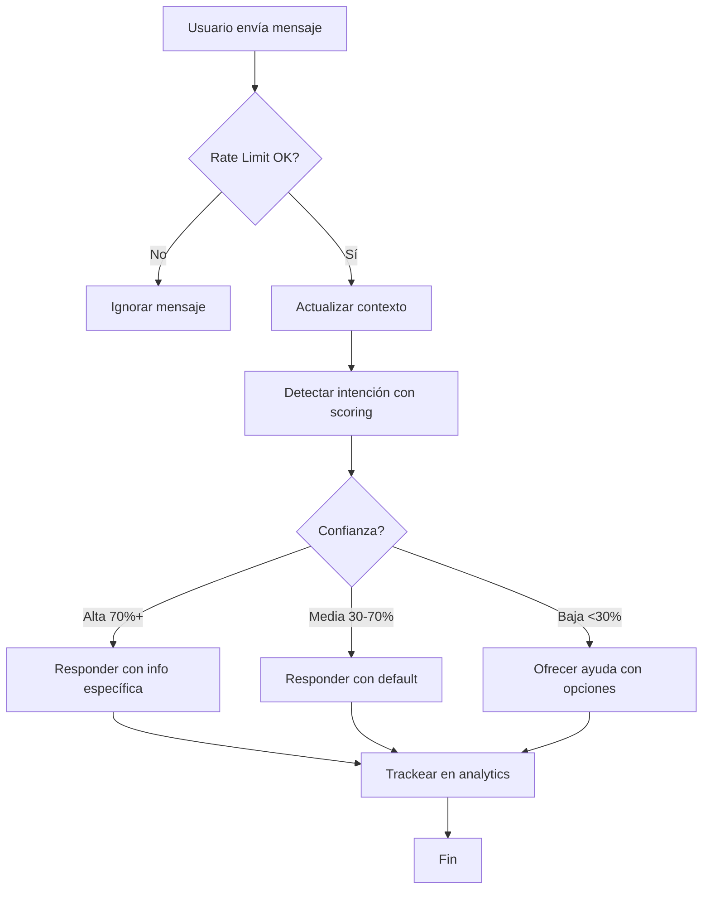

# 🏨 Auto Hotel Luxor - Chatbot WhatsApp v2.1

Chatbot inteligente de WhatsApp para Auto Hotel Luxor con sistema de reservas integrado, analytics en tiempo real, y detección de intenciones con IA.

## 🌟 Características Principales

### ✨ Versión 2.1 - Nuevas Mejoras

- **🧠 Sistema de Contexto Conversacional** - El bot recuerda la conversación (30 min de sesión)
- **🎯 Detección de Intenciones con Scoring** - Confianza del 0-100% en cada respuesta
- **🛡️ Rate Limiting Avanzado** - Protección anti-spam (15 mensajes/minuto)
- **📊 Analytics en Tiempo Real** - Métricas completas de uso y conversión
- **🔧 Manejo de Errores Mejorado** - Reintentos automáticos con backoff exponencial
- **⚡ FAQ Rápidas** - Respuestas instantáneas a preguntas comunes
- **🤔 Respuestas Inteligentes** - Ayuda contextual cuando la confianza es baja

### 🎯 Funcionalidades Core

- ✅ Información de habitaciones y precios
- ✅ Sistema de reservas con WhatsApp Flows
- ✅ Paquetes especiales y promociones
- ✅ Galería de fotos
- ✅ Información de servicios, horarios y ubicación
- ✅ Respuestas interactivas con botones
- ✅ Manejo de mensajes duplicados

## 📋 Requisitos

- Node.js 14 o superior
- Cuenta de WhatsApp Business
- Meta App configurada con WhatsApp API
- Variables de entorno configuradas

## 🚀 Instalación

```bash
# Clonar repositorio
git clone [tu-repo]

# Instalar dependencias
npm install

# Configurar variables de entorno
cp .env.example .env
# Editar .env con tus credenciales

# Iniciar servidor
npm start
```

## ⚙️ Configuración

Crea un archivo `.env` con las siguientes variables:

```env
# WhatsApp API Credentials
VERIFY_TOKEN=tu_token_de_verificacion
WHATSAPP_PHONE_NUMBER_ID=tu_phone_number_id
FLOW_ID=tu_flow_id

# Server Configuration
PORT=3000
```

## 📡 Endpoints API

### Webhook de WhatsApp
- **POST** `/webhook` - Recibe mensajes de WhatsApp
- **GET** `/webhook` - Verifica el webhook

### Health & Testing
- **GET** `/health` - Health check del servidor
- **POST** `/test-flow/:phone` - Prueba manual del flow de reservas

### 📊 Analytics (Nuevo en v2.1)
- **GET** `/analytics` - Métricas completas del chatbot
- **GET** `/analytics/summary` - Resumen rápido de métricas
- **GET** `/analytics/user/:phone` - Estadísticas de usuario específico

### Ejemplo de Analytics:
```bash
curl http://localhost:3000/analytics/summary
```

Respuesta:
```json
{
  "success": true,
  "summary": {
    "totalMessages": 250,
    "activeUsers": 15,
    "totalUsers": 45,
    "errorRate": "2.00%",
    "topIntent": "precios",
    "topIntentCount": 35
  }
}
```

## 🧪 Testing

### Probar las Mejoras

```bash
# Ejecutar suite de tests de las nuevas características
node test-improvements.js
```

Esto probará:
- ✅ Detección de intenciones con scoring
- ✅ Rate limiting avanzado
- ✅ Sistema de contexto
- ✅ Tracking de interacciones
- ✅ Analytics globales
- ✅ FAQ rápidas
- ✅ Validación de mensajes

### Ver Analytics desde Código

```javascript
const chatbot = require('./autoreply');
const analytics = require('./analytics');

// Obtener métricas completas
const stats = chatbot.getAnalytics();
console.log(stats);

// Ver stats de usuario específico
const userStats = chatbot.getUserStats('+5214421234567');
console.log(userStats);

// Usar módulo de analytics
analytics.getAllAnalytics();
analytics.quickSummary();
```

## 📊 Intenciones Detectadas

El chatbot puede detectar automáticamente las siguientes intenciones:

| Intención | Palabras Clave | Confianza |
|-----------|---------------|-----------|
| **reservar** | reservar, reserva, booking, agendar | Alta |
| **habitaciones** | habitación, cuarto, suites, tipos | Alta |
| **precios** | precio, tarifa, costo, cuanto cuesta | Alta |
| **paquetes** | paquetes, decoradas, promociones | Alta |
| **fotos** | fotos, galería, imágenes, ver fotos | Alta |
| **servicios** | servicios, amenidades, comodidades | Alta |
| **horarios** | horarios, check-in, check-out, abierto | Alta |
| **ubicacion** | ubicación, dirección, como llegar | Alta |
| **exclusivos** | exclusivos, premium, personalizados | Media |
| **menu** | menu, ayuda, opciones, help | Alta |

### Sistema de Scoring

- **🟢 100%** - Coincidencia exacta
- **🟡 90%** - FAQ común detectada
- **🟠 30-90%** - Coincidencia parcial
- **🔴 <30%** - Baja confianza → Ofrece ayuda

## 🛡️ Seguridad

- ✅ Rate limiting: 15 mensajes por minuto por usuario
- ✅ Protección contra duplicados con cache (30 segundos)
- ✅ Validación de mensajes vacíos y spam
- ✅ Manejo seguro de errores
- ✅ Limpieza automática de memoria

## 📈 Métricas de Negocio

El sistema ahora trackea:

1. **Tasa de Conversión** - % usuarios que llegan a reservar
2. **Intenciones Populares** - Qué buscan más los usuarios
3. **Tasa de Error** - Calidad del servicio
4. **Usuarios Activos** - Engagement en tiempo real
5. **Promedio de Mensajes** - Profundidad de interacción

## 🔄 Flujo de Conversación



## 📁 Estructura del Proyecto

```
whatsapp-test/
├── app.js                 # Servidor Express y endpoints
├── autoreply.js          # Lógica principal del chatbot (mejorado)
├── analytics.js          # Módulo de analytics (nuevo)
├── responses.js          # Respuestas predefinidas
├── message-sender.js     # Envío de mensajes a WhatsApp
├── flow.js               # Lógica del flow de reservas
├── decrypt.js            # Desencriptación de flows
├── encrypt.js            # Encriptación de flows
├── helpers.js            # Funciones auxiliares
├── logger.js             # Sistema de logging
├── test-improvements.js  # Tests de mejoras (nuevo)
├── MEJORAS.md           # Documentación de mejoras (nuevo)
└── README.md            # Este archivo
```

## 🔍 Debugging

### Ver logs en tiempo real:
```bash
# Iniciar servidor en modo verbose
npm start
```

### Modo Debug:
```javascript
const analytics = require('./analytics');
analytics.debugMode();
```

### Ver contexto de usuarios:
```bash
curl http://localhost:3000/analytics
```

## 📚 Documentación Adicional

- [MEJORAS.md](./MEJORAS.md) - Documentación completa de mejoras v2.1
- [test-improvements.js](./test-improvements.js) - Suite de tests

## 🎯 Casos de Uso

### 1. Usuario busca precios
```
Usuario: "cuanto cuesta una habitación?"
Bot: [Detecta intent: 'precios' con 90% confianza]
Bot: [Envía tabla de precios con botones]
```

### 2. Usuario confundido
```
Usuario: "algo para el finde"
Bot: [Detecta baja confianza: 20%]
Bot: 🤔 No estoy seguro de entender...
Bot: [Ofrece opciones específicas]
```

### 3. Usuario spammer
```
Usuario: [20 mensajes en 30 segundos]
Bot: [Activa rate limiting]
Bot: [Ignora mensajes excesivos]
```

## 🚀 Despliegue

### Producción
```bash
# Con PM2
pm2 start app.js --name "hotel-chatbot"

# Verificar
pm2 status
pm2 logs hotel-chatbot
```

### Monitoreo
```bash
# Ver analytics
curl http://tu-servidor.com/analytics/summary

# Health check
curl http://tu-servidor.com/health
```

## 📝 Changelog

### v2.1 (Nov 2024)
- ✨ Sistema de contexto conversacional
- ✨ Detección de intenciones con scoring
- ✨ Rate limiting avanzado
- ✨ Analytics en tiempo real
- ✨ Manejo de errores mejorado
- ✨ FAQ rápidas
- ✨ Respuestas inteligentes para baja confianza

### v2.0 (Anterior)
- ✅ Sistema de reservas con Flows
- ✅ Respuestas interactivas
- ✅ Gestión de habitaciones y precios

## 🤝 Contribuir

Las contribuciones son bienvenidas. Por favor:

1. Fork el proyecto
2. Crea una rama para tu feature (`git checkout -b feature/AmazingFeature`)
3. Commit tus cambios (`git commit -m 'Add some AmazingFeature'`)
4. Push a la rama (`git push origin feature/AmazingFeature`)
5. Abre un Pull Request

## 📞 Soporte

- **Hotel:** Auto Hotel Luxor
- **Teléfono:** +52 442 210 3292
- **Website:** https://autohoteluxor.com

## 📄 Licencia

[Tu licencia aquí]

---

**Versión:** 2.1  
**Estado:** ✅ Production Ready  
**Última actualización:** Noviembre 2024
